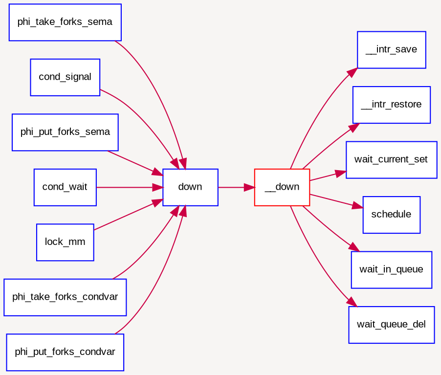
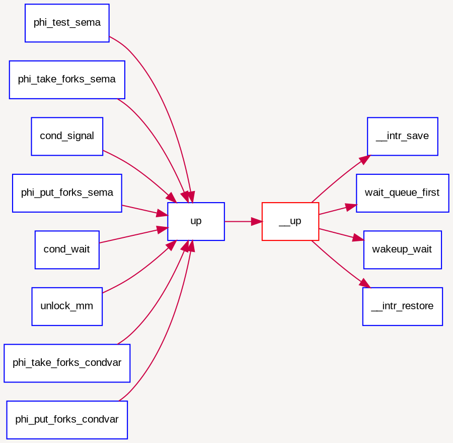

# Lab7: 互斥和同步
## 实验目的

* 理解操作系统的同步互斥的设计实现；
* 理解底层支撑技术：使能/禁用中断、等待队列；
* 理解信号量（semaphore）机制的具体实现；
* 理解基于条件变量（condition variable）的管程（monitor）机制的具体实现；
* 了解经典进程同步问题，并能使用同步机制解决进程同步问题。


## 实验内容

实验六完成了用户进程的调度框架和具体的调度算法，可调度运行多个进程。如果多个进程需要协同操作或访问共享资源，则存在如何同步和有序竞争的问题。本次实验，主要是熟悉rcore的进程同步机制—信号量机制和管程机制，以及基于信号量和管程的哲学家就餐问题解决方案。在kern/src/sync/test.rs中提供了基于信号量和管程（主要使用条件变量和互斥信号量）的哲学家就餐问题解法。

哲学家就餐问题描述如下：有五个哲学家，他们的生活方式是交替地进行思考和进餐。哲学家们公用一张圆桌，周围放有五把椅子，每人坐一把。在圆桌上有五个碗和五根筷子，当一个哲学家思考时，他不与其他人交谈，饥饿时便试图取用其左、右最靠近他的筷子，但他可能一根都拿不到。只有在他拿到两根筷子时，方能进餐，进餐完后，放下筷子又继续思考。

## 上下关系

。。。

## 系列练习

- 实现读写锁/MCS Lock/ticket Lock/RCU

## 实验原理

### 实验执行流程概述
互斥是指某一资源同时只允许一个进程对其进行访问，具有唯一性和排它性，但互斥不用限制进程对资源的访问顺序，即访问可以是无序的。同步是指在进程间的执行必须严格按照规定的某种先后次序来运行，即访问是有序的，这种先后次序取决于要系统完成的任务需求。在进程写资源情况下，进程间要求满足互斥条件。在进程读资源情况下，可允许多个进程同时访问资源。

实验七设计实现了多种同步互斥手段，包括中断管理、等待队列、信号量、管程机制（包含条件变量设计）等，并基于信号量和管程实现了哲学家问题的执行过程。在实现信号量机制和管程机制时，需要让无法进入临界区的进程睡眠，为此在rcore中设计了等待队列wait_queue。当进程无法进入临界区（即无法获得信号量）时，可让进程进入等待队列，这时的进程处于等待状态（也可称为阻塞状态），从而会让实验六中的调度器选择一个处于就绪状态（即RUNNABLESTATE）的进程，进行进程切换，让新进程有机会占用CPU执行，从而让整个系统的运行更加高效。

在实验七中的rcore初始化函数rust_main执行过程中，会调用`crate::process::init()`函数，而这个函数会调用`processor().manager().add()`来创建`philosopher_using_mutex`和`philosopher_using_monitor`内核线程，分别实现基于信号量的哲学家问题和基于管程的哲学家问题。

对于`philosopher_using_mutex`内核线程，首先创建了对应5个哲学家行为的5个Mutex信号量，并创建5个内核线程代表5个哲学家，每个内核线程完成了基于信号量的哲学家吃饭思考行为实现。

对于`philosopher_using_monitor`内核线程，首先初始化了管程（由5个Mutex信号量和条件变量组成），然后又创建了5个内核线程代表5个哲学家，每个内核线程要完成基于管程的哲学家吃饭、思考的行为实现。


 ### 用于内核的同步互斥接口

 在实验七中提供了和`std::sync`相同的接口，具体用法可参考std官方文档。具体实现的同步互斥接口如下：

 * `mutex`: 互斥锁。参考`spin::Mutex`实现了一套可替换底层支持的锁框架，在此基础上实现了三种锁：`SpinLock`自旋锁，`SpinNoIrqLock`禁用中断自旋锁，`ThreadLock`线程调度锁

 * `condvar`: 条件变量。依赖`thread`，为其它工具提供线程调度支持。

 * `semaphore`: 信号量。完全照搬`std::sync::Semaphore`，std中已经废弃。貌似在Rust中并不常用，一般都用`Mutex`。


#### 三种锁机制

在`kernel\src\sync\mutex.rs`中实现的Mutex框架基础上实现了以下`ThreadLock`：

 * `SpinLock`: 自旋锁。等价于`spin::Mutex`，相当于Linux中的`spin_lock`。
     当获取锁失败时，忙等待。由于没有禁用内核抢占和中断，在单处理器上使用可能发生死锁。

 * `SpinNoIrqLock`: 禁止中断的自旋锁。相当于Linux中的`spin_lock_irqsave`。在尝试获取锁之前禁用中断，在try_lock失败/解锁时恢复之前的中断状态。可被用于中断处理中，不会发生死锁。

 * `ThreadLock`: 线程调度锁。等价于`std::sync::Mutex`，依赖于`thread`模块提供线程调度支持。在获取锁失败时，将自己加入等待队列，让出CPU；在解锁时，唤醒一个等待队列中的线程。

#### 底层支撑依赖关系

同步互斥接口的底层支撑依赖关系如下图所示：

 ```mermaid
 graph TB
    subgraph dependence
        interrupt
        thread
    end
    subgraph sync
        SpinLock --> interrupt
        Condvar --> SpinLock
     Condvar --> thread
     Mutex --> Condvar
        Monitor --> Condvar
        Semaphore --> Condvar
        Semaphore --> SpinLock
        mpsc --> SpinLock
     mpsc --> Condvar
    end
 subgraph test
        Dining_Philosophers --> Mutex
        Dining_Philosophers --> Monitor
    end
 ```
 模块依赖关系图


### 同步互斥的底层支撑 

由于有处理器调度的存在，且进程在访问某类资源暂时无法满足的情况下，进程会进入等待状态。这导致了多进程执行时序和潜在执行结果的不确定性。为了确保执行结果的正确性，本试验需要设计进程等待和互斥的底层支撑机制，确保能正确提供基于信号量和条件变量的同步互斥机制。

根据操作系统原理的知识，我们知道如果没有在硬件级保证读内存-修改值-写回内存的原子性，我们只能通过复杂的软件来实现同步互斥操作。但由于有屏蔽/使能中断、等待队列wait_queue支持test\_and\_set\_bit等原子操作机器指令（在本次实验中没有用到）的存在，使得我们在实现进程等待、同步互斥上得到了极大的简化。下面将对屏蔽/使能中断和等待队列等进行进一步讲解。

#### struct Mutex与trait MutexSupport
不同的互斥机制由一个struct Mutex提供template支持，不同的互斥机制都需要实现trait `MutexSupport`，并嵌入`Mutex`中。Mutex的定义如下：

```rust
pub type SpinLock<T> = Mutex<T, Spin>;
pub type SpinNoIrqLock<T> = Mutex<T, SpinNoIrq>;
pub type ThreadLock<T> = Mutex<T, Condvar>;

pub struct Mutex<T: ?Sized, S: MutexSupport>
{
    lock: AtomicBool,
    support: S,
    data: UnsafeCell<T>,
}
```

`MutexSupport`提供了若干接口，它们会在操作锁的不同时间点被调用。这些接口实际是了几种实现的并集。其定义如下：

```Rust
/// Low-level support for mutex
pub trait MutexSupport {
    type GuardData;
    fn new() -> Self;
    /// Called when failing to acquire the lock
    fn cpu_relax(&self);
    /// Called before lock() & try_lock()
    fn before_lock() -> Self::GuardData;
    /// Called when MutexGuard dropping
    fn after_unlock(&self);
}
```


#### CAS(Compare and Swap)

CAS(Compare and Swap)是个原子操作，一般由硬件直接提供指令支持。其语义是拿到一个新值后，CAS将其与内存中的值进行比较，若内存中的值和这个值不一样，则将这个值写入内存，否则，不做操作。

#### 屏蔽与使能中断

根据操作系统原理的知识，我们知道如果没有在硬件级保证读内存-修改值-写回内存的原子性，我们只能通过复杂的软件来实现同步互斥操作。但由于有开关中断和test\_and\_set\_bit等原子操作机器指令的存在，使得我们在实现同步互斥原语上可以大大简化。

在rcore中提供的底层机制包括中断屏蔽/使能控制等。kern/src/arch_rv32/interrupt.rs中实现的开关中断的控制函数`disable_and_store()` 和`interrupt::restore(...)`：
```
关中断：interrupt::disable_and_store() 
开中断：interrupt::restore(...) 
```
它们是基于kern/src/arch_rv32/riscv/register/sstatus.rs中的的`sstatus::read().sie()`、`sstatus::clear_sie()`、`sstatus::set_sie()`函数实现的。

最终是通过读写CSR的机器指令实现了关（屏蔽）中断和开（使能）中断，即设置了sstatus寄存器中与中断相关的位。通过关闭中断，可以防止对当前执行的控制流被其他中断事件处理所打断。既然不能中断，那也就意味着在内核运行的当前进程无法被打断或被重新调度，即实现了对临界区的互斥操作。所以在单处理器情况下，可以通过开关中断实现对临界区的互斥保护，需要互斥的临界区代码的一般写法为：

在多处理器情况下，仅凭开关中断这种方法是无法实现运行在多处理器中各个线程之间互斥访问资源，因为屏蔽了一个CPU的中断，只能阻止本地CPU上的进程不会被中断或调度，并不意味着其他CPU上执行的进程不能执行临界区的代码。所以，开关中断只对单处理器下的互斥操作起作用。在本实验中，开关中断机制是实现信号量等高层同步互斥原语的底层支撑基础之一。

#### 等待队列

到目前为止，我们的实验中，用户进程或内核线程还没有睡眠的支持机制。在课程中提到用户进程或内核线程可以转入等待状态以等待某个特定事件（比如睡眠,等待子进程结束,等待信号量等），当该事件发生时这些进程能够被再次唤醒。内核实现这一功能的一个底层支撑机制就是等待队列wait_queue，等待队列和每一个事件（睡眠结束、时钟到达、任务完成、资源可用等）联系起来。需要等待事件的进程在转入休眠状态后插入到等待队列中。当事件发生之后，内核遍历相应等待队列，唤醒休眠的用户进程或内核线程，并设置其状态为就绪状态（PROC_RUNNABLE），并将该进程从等待队列中清除。rcore在kernel/src/sync/condvar.rs中，为实现条件变量，设计了等待队列wait_queue结构以及相关处理。

数据结构定义
```rust
wait_queue: SpinNoIrqLock<VecDeque<thread::Thread>>
```


### 信号量 

信号量是一种同步互斥机制的实现，普遍存在于现在的各种操作系统内核里。相对于spinlock
的应用对象，信号量的应用对象是在临界区中运行的时间较长的进程。等待信号量的进程需要睡眠来减少占用
CPU 的开销。参考教科书“Operating Systems Internals and Design
Principles”第五章“同步互斥”中对信号量实现的原理性描述：

```rust
struct Semaphore {
 count:   usize，
 queue:  queueType,
};
impl Semaphore {
 fn semWait(semaphore s) {
    s.count--;
    if (s.count < 0) {
    // place this process in s.queue 
    // block this process
 }
 fn  semSignal(semaphore s) {
    s.count++;
    if (s.count<= 0) {
    // remove a process P from s.queue
    // place process P on ready list
 }
}
```

基于上诉信号量实现可以认为，当多个（\>1）进程可以进行互斥或同步合作时，一个进程会由于无法满足信号量设置的某条件而在某一位置停止，直到它接收到一个特定的信号（表明条件满足了）。为了发信号，需要使用一个称作信号量的特殊变量。为通过信号量s传送信号，信号量的V操作采用进程可执行原语semSignal(s)；为通过信号量s接收信号，信号量的P操作采用进程可执行原语semWait(s)；如果相应的信号仍然没有发送，则进程被阻塞或睡眠，直到发送完为止。

rcore中信号量参照上述原理描述，建立在开关中断机制和条件变量的基础上进行了具体实现。信号量的数据结构定义如下：

```c
typedef struct {
    int value;                   //信号量的当前值
    wait_queue_t wait_queue;     //信号量对应的等待队列
} semaphore_t;
```

semaphore\_t是最基本的记录型信号量（record
semaphore)结构，包含了用于计数的整数值value，和一个进程等待队列wait\_queue，一个等待的进程会挂在此等待队列上。

在rcore中最重要的信号量操作是P操作函数down(semaphore\_t \*sem)和V操作函数 up(semaphore\_t \*sem)。但这两个函数的具体实现是\_\_down(semaphore\_t \*sem, uint32\_t wait\_state) 函数和\_\_up(semaphore\_t \*sem, uint32\_t wait\_state)函数，二者的具体实现描述如下：

● \_\_down(semaphore\_t \*sem, uint32\_t wait\_state, timer\_t \*timer)：具体实现信号量的P操作，首先关掉中断，然后判断当前信号量的value是否大于0。如果是\>0，则表明可以获得信号量，故让value减一，并打开中断返回即可；如果不是\>0，则表明无法获得信号量，故需要将当前的进程加入到等待队列中，并打开中断，然后运行调度器选择另外一个进程执行。如果被V操作唤醒，则把自身关联的wait从等待队列中删除（此过程需要先关中断，完成后开中断）。具体实现如下所示：

```c
static __noinline uint32_t __down(semaphore_t *sem, uint32_t wait_state) {
    bool intr_flag;
    local_intr_save(intr_flag);
    if (sem->value > 0) {
        sem->value --;
        local_intr_restore(intr_flag);
        return 0;
    }
    wait_t __wait, *wait = &__wait;
    wait_current_set(&(sem->wait_queue), wait, wait_state);
    local_intr_restore(intr_flag);

    schedule();

    local_intr_save(intr_flag);
    wait_current_del(&(sem->wait_queue), wait);
    local_intr_restore(intr_flag);

    if (wait->wakeup_flags != wait_state) {
        return wait->wakeup_flags;
    }
    return 0;
}
```

与`__down`相关的调用和被调用函数关系图如下所示：



● \_\_up(semaphore\_t \*sem, uint32\_t
wait\_state)：具体实现信号量的V操作，首先关中断，如果信号量对应的wait
queue中没有进程在等待，直接把信号量的value加一，然后开中断返回；如果有进程在等待且进程等待的原因是semophore设置的，则调用wakeup\_wait函数将waitqueue中等待的第一个wait删除，且把此wait关联的进程唤醒，最后开中断返回。具体实现如下所示：

```c
static __noinline void __up(semaphore_t *sem, uint32_t wait_state) {
    bool intr_flag;
    local_intr_save(intr_flag);
    {
        wait_t *wait;
        if ((wait = wait_queue_first(&(sem->wait_queue))) == NULL) {
            sem->value ++;
        }
        else {
            wakeup_wait(&(sem->wait_queue), wait, wait_state, 1);
        }
    }
    local_intr_restore(intr_flag);
}
```

与`__up`相关的调用和被调用函数关系图如下所示：



对照信号量的原理性描述和具体实现，可以发现二者在流程上基本一致，只是具体实现采用了关中断的方式保证了对共享资源的互斥访问，通过等待队列让无法获得信号量的进程睡眠等待。另外，我们可以看出信号量的计数器value具有有如下性质：

* value\>0，表示共享资源的空闲数
* vlaue<0，表示该信号量的等待队列里的进程数
* value=0，表示等待队列为空


### 管程和条件变量 

#### 原理回顾
引入了管程是为了将对共享资源的所有访问及其所需要的同步操作集中并封装起来。Hansan为管程所下的定义：“一个管程定义了一个数据结构和能为并发进程所执行（在该数据结构上）的一组操作，这组操作能同步进程和改变管程中的数据”。有上述定义可知，管程由四部分组成：

* 管程内部的共享变量；
* 管程内部的条件变量；
* 管程内部并发执行的进程；
* 对局部于管程内部的共享数据设置初始值的语句。

局限在管程中的数据结构，只能被局限在管程的操作过程所访问，任何管程之外的操作过程都不能访问它；另一方面，局限在管程中的操作过程也主要访问管程内的数据结构。由此可见，管程相当于一个隔离区，它把共享变量和对它进行操作的若干个过程围了起来，所有进程要访问临界资源时，都必须经过管程才能进入，而管程每次只允许一个进程进入管程，从而需要确保进程之间互斥。

但在管程中仅仅有互斥操作是不够用的。进程可能需要等待某个条件Cond为真才能继续执行。如果采用[忙等](http://zh.wikipedia.org/w/index.php?title=%E5%BF%99%E7%AD%89%E5%BE%85&action=edit&redlink=1 "忙等待（页面不存在）")(busy
waiting)方式：

```
while not( Cond ) do {}
```

在单处理器情况下，将会导致所有其它进程都无法进入[临界区](http://zh.wikipedia.org/wiki/%E4%B8%B4%E7%95%8C%E5%8C%BA "临界区")使得该条件Cond为真，该管程的执行将会发生[死锁](http://zh.wikipedia.org/wiki/%E6%AD%BB%E9%94%81 "死锁")。为此，可引入条件变量（Condition
Variables，简称CV）。一个条件变量CV可理解为一个进程的等待队列，队列中的进程正等待某个条件Cond变为真。每个条件变量关联着一个条件，如果条件Cond不为真，则进程需要等待，如果条件Cond为真，则进程可以进一步在管程中执行。需要注意当一个进程等待一个条件变量CV（即等待Cond为真），该进程需要退出管程，这样才能让其它进程可以进入该管程执行，并进行相关操作，比如设置条件Cond为真，改变条件变量的状态，并唤醒等待在此条件变量CV上的进程。因此对条件变量CV有两种主要操作：

* wait\_cv： 被一个进程调用，以等待断言Pc被满足后该进程可恢复执行.
进程挂在该条件变量上等待时，不被认为是占用了管程。
* signal\_cv：被一个进程调用，以指出断言Pc现在为真，从而可以唤醒等待断言Pc被满足的进程继续执行。

#### "哲学家就餐"实例
有了互斥和信号量支持的管程就可用用了解决各种同步互斥问题。比如参考《OS
Concept》一书中的6.7.2小节“用管程解决哲学家就餐问题”就给出了这样的事例：
```c
monitor dp
{
	enum {THINKING, HUNGRY, EATING} state[5];
	condition self[5];

	void pickup(int i) {
		state[i] = HUNGRY;
		test(i);
		if (state[i] != EATING)
			self[i].wait_cv();
	}

	void putdown(int i) {
		state[i] = THINKING;
		test((i + 4) % 5);
		test((i + 1) % 5);
	}
	
	void test(int i) {
		if ((state[(i + 4) % 5] != EATING) &&
		   (state[i] == HUNGRY) &&
		   (state[(i + 1) % 5] != EATING)) {
			  state[i] = EATING;
			  self[i].signal_cv();
        }
    }

	initialization code() {
		for (int i = 0; i < 5; i++)
		state[i] = THINKING;
		}
}
```

#### 关键数据结构
虽然大部分教科书上说明管程适合在语言级实现比如java等高级语言，没有提及在采用C语言的OS中如何实现。下面我们将要尝试在rcore中用C语言实现采用基于互斥和条件变量机制的管程基本原理。

rcore中的管程机制是基于信号量和条件变量来实现的。rcore中的管程的数据结构monitor\_t定义如下：

```c
typedef struct monitor{
    semaphore_t mutex;      // the mutex lock for going into the routines in monitor, should be initialized to 1
    // the next semaphore is used to 
    //    (1) procs which call cond_signal funciton should DOWN next sema after UP cv.sema
    // OR (2) procs which call cond_wait funciton should UP next sema before DOWN cv.sema
    semaphore_t next;        
    int next_count;         // the number of of sleeped procs which cond_signal funciton
    condvar_t *cv;          // the condvars in monitor
} monitor_t;
```

管程中的成员变量mutex是一个二值信号量，是实现每次只允许一个进程进入管程的关键元素，确保了[互斥](http://zh.wikipedia.org/wiki/%E4%BA%92%E6%96%A5 "互斥")访问性质。管程中的条件变量cv通过执行`wait_cv`，会使得等待某个条件Cond为真的进程能够离开管程并睡眠，且让其他进程进入管程继续执行；而进入管程的某进程设置条件Cond为真并执行`signal_cv`时，能够让等待某个条件Cond为真的睡眠进程被唤醒，从而继续进入管程中执行。

注意：管程中的成员变量信号量next和整型变量next\_count是配合进程对条件变量cv的操作而设置的，这是由于发出`signal_cv`的进程A会唤醒由于`wait_cv`而睡眠的进程B，由于管程中只允许一个进程运行，所以进程B执行会导致唤醒进程B的进程A睡眠，直到进程B离开管程，进程A才能继续执行，这个同步过程是通过信号量next完成的；而next\_count表示了由于发出`singal_cv`而睡眠的进程个数。

管程中的条件变量的数据结构condvar\_t定义如下：

```c
typedef struct condvar{
    semaphore_t sem; 	// the sem semaphore is used to down the waiting proc, and the signaling proc should up the waiting proc
    int count;       　	// the number of waiters on condvar
    monitor_t * owner; 	// the owner(monitor) of this condvar
} condvar_t;
```

条件变量的定义中也包含了一系列的成员变量，信号量sem用于让发出`wait_cv`操作的等待某个条件Cond为真的进程睡眠，而让发出`signal_cv`操作的进程通过这个sem来唤醒睡眠的进程。count表示等在这个条件变量上的睡眠进程的个数。owner表示此条件变量的宿主是哪个管程。


#### 条件变量的signal和wait的设计
理解了数据结构的含义后，我们就可以开始管程的设计实现了。rcore设计实现了条件变量`wait_cv`操作和`signal_cv`操作对应的具体函数，即`cond_wait`函数和`cond_signal`函数，此外还有`cond_init`初始化函数（可直接看源码）。函数`cond_wait(condvar_t *cvp, semaphore_t *mp)`和`cond_signal (condvar_t *cvp)`的实现原理参考了《OS Concept》一书中的6.7.3小节“用信号量实现管程”的内容。首先来看`wait_cv`的原理实现：

** wait_cv的原理描述 **

```c
cv.count++;
if(monitor.next_count > 0)
   sem_signal(monitor.next);
else
   sem_signal(monitor.mutex);
sem_wait(cv.sem);
cv.count -- ;
```


对照着可分析出`cond_wait`函数的具体执行过程。可以看出如果进程A执行了`cond_wait`函数，表示此进程等待某个条件Cond不为真，需要睡眠。因此表示等待此条件的睡眠进程个数cv.count要加一。接下来会出现两种情况。

情况一：如果monitor.next\_count如果大于0，表示有大于等于1个进程执行cond\_signal函数且睡了，就睡在了monitor.next信号量上（假定这些进程挂在monitor.next信号量相关的等待队列Ｓ上），因此需要唤醒等待队列Ｓ中的一个进程B；然后进程A睡在cv.sem上。如果进程A醒了，则让cv.count减一，表示等待此条件变量的睡眠进程个数少了一个，可继续执行了！

> 这里隐含这一个现象，即某进程A在时间顺序上先执行了`cond_signal`，而另一个进程B后执行了`cond_wait`，这会导致进程A没有起到唤醒进程B的作用。

> 问题: 在cond\_wait有sem\_signal(mutex)，但没有看到哪里有sem\_wait(mutex)，这好像没有成对出现，是否是错误的？
> 答案：其实在管程中的每一个函数的入口处会有wait(mutex)，这样二者就配好对了。

情况二：如果monitor.next\_count如果小于等于0，表示目前没有进程执行cond\_signal函数且睡着了，那需要唤醒的是由于互斥条件限制而无法进入管程的进程，所以要唤醒睡在monitor.mutex上的进程。然后进程A睡在cv.sem上，如果睡醒了，则让cv.count减一，表示等待此条件的睡眠进程个数少了一个，可继续执行了！

然后来看`signal_cv`的原理实现：

** signal_cv的原理描述 **

```c
if( cv.count > 0) {
   monitor.next_count ++;
   sem_signal(cv.sem);
   sem_wait(monitor.next);
   monitor.next_count -- ;
}
```

对照着可分析出`cond_signal`函数的具体执行过程。首先进程B判断cv.count，如果不大于0，则表示当前没有执行cond\_wait而睡眠的进程，因此就没有被唤醒的对象了，直接函数返回即可；如果大于0，这表示当前有执行cond\_wait而睡眠的进程A，因此需要唤醒等待在cv.sem上睡眠的进程A。由于只允许一个进程在管程中执行，所以一旦进程B唤醒了别人（进程A），那么自己就需要睡眠。故让monitor.next\_count加一，且让自己（进程B）睡在信号量monitor.next上。如果睡醒了，这让monitor.next\_count减一。


#### 管程中函数的入口出口设计
为了让整个管程正常运行，还需在管程中的每个函数的入口和出口增加相关操作，即：

```
function_in_monitor （…）
{
  sem.wait(monitor.mutex);
//-----------------------------
  the real body of function;
//-----------------------------
  if(monitor.next_count > 0)
     sem_signal(monitor.next);
  else
     sem_signal(monitor.mutex);
} 
```

这样带来的作用有两个，（1）只有一个进程在执行管程中的函数。（2）避免由于执行了cond\_signal函数而睡眠的进程无法被唤醒。对于第二点，如果进程A由于执行了cond\_signal函数而睡眠（这会让monitor.next\_count大于0，且执行sem\_wait(monitor.next)），则其他进程在执行管程中的函数的出口，会判断monitor.next\_count是否大于0，如果大于0，则执行sem\_signal(monitor.next)，从而执行了cond\_signal函数而睡眠的进程被唤醒。上诉措施将使得管程正常执行。

需要注意的是，上述只是原理描述，与具体描述相比，还有一定的差距。需要大家在完成练习时仔细设计和实现。

